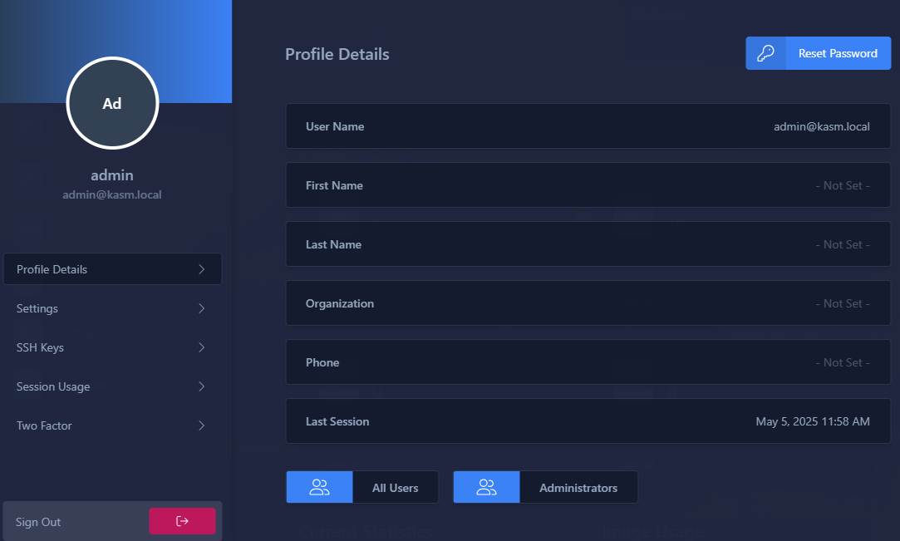
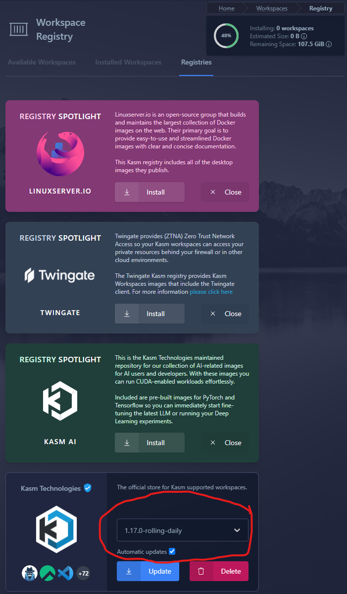
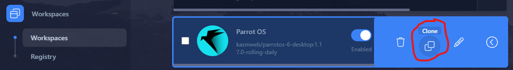

# Detective in a Box
This repository contains various files, configurations, tips, and tricks to help individual security researchers build their own reasonably hardened research platform on a minimal budget. A blog post discussing implementation and operational security measures for various risk levels will accompany this repository at a later date. Check back here for updates, or keep an eye out at [Hax4Libre.com](https://hax4libre.com).


## Hardware Requirements
This build assumes access to an [Ubuntu 24.04 server](https://ubuntu.com/download/server) (or a device capable of hosting one) and a laptop/desktop (PC, Mac, or Linux) on the same home network. A remote server would be ideal but is outside the scope of this guide, as the intent is to minimize initial costs. A Unifi console device and switch will be used for VLAN segmentation, but any router/firewall/switch with similar features should suffice.

If you're looking for new hardware on a budget, [OpenWrt](https://openwrt.org/) and [OPNsense](https://opnsense.org/) are good options that run on a [Raspberry Pi](https://www.raspberrypi.com/products/) or any old PC. Avoid products like GL.iNet, MicroTik, RouterBoard, and TP-Link. If you have more time and money, [Protectli](https://protectli.com/) and [Firewalla](https://firewalla.com/) offer excellent options. For those with a larger budget and reliable cell service, [Peplink](https://www.peplink.com/) is worth exploring. If you're upgrading from an ISP-provided router, [Unifi](https://ui.com/us/en/cloud-gateways/wifi-integrated/dream-router) is a solid investment. Ideally, a Protectli firewall inside a Unifi network would be optimal for this type of work, but this guide focuses on minimizing expense.

Below are the minimum hardware requirements for each layer:

| Layer   | Minimum Dependency |
|---------|---------------------|
| Network | Unifi Network 9.0+, or pfSense, OPNsense, OpenWrt, etc. |
| Server  | 2+ cores, 8+ GB RAM, 256+ GB storage |
| Client  | Windows 11, macOS 15, or a current Linux desktop |

## Cost
Assuming the minimum hardware requirements are met, the only required expense is a VPN license. [Mullvad](https://mullvad.net/en) supports five devices for ~$68/year (€60/year). [IVPN](https://www.ivpn.net/en/) is another option worth exploring. [Obscura](https://obscura.net/) is a new player with an interesting offering, though it's currently only available for macOS. Mullvad offers several payment options:

- **Cash:**
Send cash to Sweden with your payment token
  - Fun
  - Not fast
- **Amazon Voucher:**
Purchase a physical voucher
  - Leaves a purchase record in your Amazon history
  - Shipping times may vary
- **Cryptocurrency:**
Accepts Monero, Bitcoin, Bitcoin Cash, and Bitcoin Lightning
  - If you're into that sort of thing
- **Credit Card:**
Via Stripe
  - Leaves a transaction record in your bank account
  - Mullvad claims to delete the Stripe charge ID and timestamp after 40 days
- **Other:**
PayPal, bank wire transfer, Swish, Eps transfer, Bancontact, iDEAL, and Przelewy24
  - These should be an absolute last resort

Mullvad claims not to log customer IPs, but for added privacy, consider using the Tor Browser or at minimum an incognito session over a mobile network when making your purchase.

## Network
Before starting, acquire a VPN account. The commercial VPN industry is fraught with unreliable providers, but Mullvad stands out for its reasonable pricing, privacy focus, and support for Wireguard and OpenVPN.

Unfortunately, Unifi OS and Mullvad's Wireguard configurations don't play well together (likely due to Unifi's Wireguard implementation). For this project, we'll use Mullvad's OpenVPN configuration for all traffic exiting the VLAN. Ensure your VPN provider supports both Wireguard and OpenVPN. This VPN layer serves as a failover for when/if client VPNs drop.

### Configuring an Isolated VLAN and VPN on Unifi
The following steps provide a general overview of configuring an isolated VLAN and VPN on a Unifi device. For an in-depth discussion of Unifi's advanced security features, refer to the [Unifi Help Center](https://help.ui.com/hc/en-us/articles/30426718447639-UniFi-Network-Security-Firewalls-Segmentation-and-Advanced-Protection).

1. **Create a New Virtual Network:**
   - Navigate to `Network > Settings > Networks`
   - Create a `New Virtual Network`
   - Set a name and `Zone` to `Internal` (we'll change this later)
   - Use a /24 subnet (e.g., `192.168.X.1/24`)
   - Assign a `VLAN ID` for later use
   - Enable `Isolate Network` and `DHCP Guarding`
   - Leave `Content Filtering` as `None` and `Multicast DNS` unchecked
   - Optionally, add a `Domain Name` (e.g., `lan`)

   

2. **Create a Firewall Zone:**
   - Go to `Security > Firewall`
   - Click `Create Zone`, name it, and assign your VLAN as the `Network Interface`
   - Return to your VLAN's settings and ensure the zone updated. If not, set to the new zone

3. **Set Up a VPN Client:**
   - Go to `VPN > VPN Client > Create New`
   - Download Mullvad's OpenVPN configuration file (choose `Android/ChromeOS` as the platform)
     - If your threat model allows, choose a geographically close exit location
   - Import the `.ovpn` file and use your Mullvad account ID as the `Username` and `m` as the `Password`
   - You'll see a green dot 🟢 next to the VPN Client name indicating the connection is established

4. **Configure Policy-Based Routing:**
   - Go to `Routing > Policy-Based Routing > Create Entry`
   - Set your VLAN as the `Source`, `Destination` as `Any`, and your VPN client as the `Interface/VPN Tunnel`
   - Enable the `Kill Switch`

5. ***Optionally,* Configure Switch Ports:**
   - Navigate to `Network > Ports`
   - Select at least two unused ports to dedicate to your VLAN
   - Ensure selected ports are `Active` and set `Network VLAN/Network` as your VLAN
   - Set `Tagged VLAN Management` to `Block All`
   - Leave `Advanced` set to `Auto`
   - Now, these ports will only allow traffic with the new VLAN tag

6. **Enable Bonus Features:**
   - Go to `Security > Protection`
   - Add a `Honeypot`
   - Add your VLAN to the `Intrusion Prevention System`

Once you've gone through the initial setup process for each device, it's a good idea to go back to the `Client Devices` tab in your Unifi Network app and set a `Fixed IP` for each device. You can also configure a `Local DNS Record` for your server.

Congratulations! You've just built your very own isolated network that routes all external traffic through a commercial VPN and integrates basic network defenses. You're now ready to plug your server and client devices into your new secure network! 🎉

### Notes on Networking
Avoid configuring WiFi for this network. Wireless access introduces unnecessary vulnerabilities and complication. Instead, use a USB-C to Ethernet adapter to connect mobile devices directly to an isolated switch port in the VLAN. These adapters are inexpensive (less than $20) and provide a more secure, reliable connection.

## Client Configuration
Client-side configuration is straightforward for this project. However, it is critical to avoid commingling personal, professional, and research activities within the same environment. Tips for compartmentalizing information will be included in the accompanying blog post. For now, focus on ensuring the baseline components are installed and functioning correctly. If you're reusing existing hardware, consider performing a clean install of the operating system before proceeding.

### Testing the Network
Once your VPN is running on the network, test the setup to ensure the firewall rules are functioning correctly. Additionally, attempt to reach the new VLAN from other VLANs to confirm isolation. Mullvad's [Connection Check](https://mullvad.net/en/check) is a helpful tool for verifying VPN functionality.

Here are some basic networking commands for testing:
```bash
# Check if you can reach Google
ping 8.8.8.8

# Test internal connectivity where X is a known device IP
ping 192.168.1.X

# Test DNS resolution
nslookup google.com

# Check public IPv4 address
curl -4 icanhazip.com

# Check IPv6 (this should fail)
curl -6 icanhazip.com
```

### Install Essential Tools
Install Mullvad's VPN client on your workstation, along with a variety of browsers and virtualization tools. These tools will help you maintain compartmentalization and enhance your research capabilities:

- **Browsers:**
  - [Mullvad Browser](https://mullvad.net/en/download/browser/windows) – Set SOCKS5 Proxy for a third hop (RouterVPN > ClientVPN > SOCKS5)
    - NOTE: This can even be extended to four hops by setting the desktop client to use multihop, or you could forgo the proxy at that point, unless you just want a browser with a different endpoint
  - [Kasm **Open in Isolation** Browser Extension](https://kasmweb.com/docs/latest/how_to/kasm_extension.html) – Useful for isolating suspicious links
  - [Firefox](https://www.mozilla.org/en-US/firefox/new/)
  - [Brave](https://brave.com/)
  - [Vivaldi](https://vivaldi.com/)
  - [Tor Browser](https://www.torproject.org/download/)

- **Virtualization Tools:**
  - [VirtualBox + Extension Pack](https://www.virtualbox.org/wiki/Downloads)
  - [VMware Workstation Pro](https://blogs.vmware.com/workstation/2024/05/vmware-workstation-pro-now-available-free-for-personal-use.html)
  - [Windows Subsystem for Linux (WSL)](https://learn.microsoft.com/en-us/windows/wsl/)
  - [Kali for WSL with Win-Kex](https://www.kali.org/docs/wsl/wsl-preparations/) – Optional, but pretty cool on a Surface Pro 11

### Download ISOs and OVAs
Prepare virtual machine images for resource-intensive or sensitive tasks. Most tasks will be handled in ephemeral containers, but VMs are useful for specific scenarios. Recommended images include:
- [Whonix](https://www.whonix.org/wiki/VirtualBox) – CLI and GUI versions
- [Ubuntu](https://ubuntu.com/download/desktop) – LTS Desktop and/or Server 
- [Windows 11](https://microsoft.com/en-us/software-download/windows11) – The ISO, not the Media Creation Tool
  - NOTE: Microsoft doesn't like downloads over VPN connections
- Other distros like [Kali](https://www.kali.org/get-kali/), [Mobexler](https://www.mobexler.com/), [ParrotOS](https://www.parrotsec.org/download/), [REMnux](https://docs.remnux.org/install-distro/get-virtual-appliance), [SIFT](https://www.sans.org/tools/sift-workstation/), [Slingshot](https://www.sans.org/tools/slingshot/), and [TraceLabs](https://www.tracelabs.org/initiatives/osint-vm), etc...

## Server Configuration
Once the client-side setup is complete, it's time to configure the server. Begin by hardening the BIOS and installing the operating system.

### BIOS Update and Configuration
Refer to your hardware manufacturer's documentation for specific BIOS update instructions. For Intel NUCs with Aptio V BIOS, follow the [F7 BIOS update instructions](https://dlcdnets.asus.com/pub/ASUS/NUC/Others/NUC-AptioV-UEFI-Firmware-BIOS-Update-Readme_01232024.pdf) from ASUS. If you're not sure which Intel BIOS you're using refer to [the support docs](https://www.intel.com/content/www/us/en/support/articles/000006028/intel-nuc.html). Between 2023 and 2024 Intel discontinued NUC development and transitioned support to ASUS. Use the [ASUS support page](https://www.asus.com/us/support/) to search for your model and download the most recent updates.

1. **Disable Unnecessary Features:**
Use `F2` to enter the Aptio V BIOS on a NUC. You're device may use a different key depending on manufacturer. Disable unused interfaces and features, such as **HD Audio**, **WLAN**, **Bluetooth**, **Wake on LAN**, and **Wake on TV**. Also disable unnecessary boot options such as **Optical Boot** and **Network Boot**. Disable **Allow UEFI 3rd Party Driver Loaded** unless you know it's required for your device to function.

2. **Set BIOS Password and Enable Security Features:**
Set a supervisor/administrator password to prevent unauthorized BIOS changes. Enable security features like **Intel Virtualization Technology**, **Intel Trusted Execution Technology**, and **Intel VT for Directed I/O (VT-d)**. If a hardware TPM is not available, enable **Intel Platform Trust Technology (PTT)** as a firmware alternative. Consider enabling `Selfhealing BIOS Support` or similar functionality.

3. **Secure Boot:**
Unfortunately, if you plan to use Kasm's [Webcam Pass-through](https://kasmweb.com/docs/latest/guide/webcam_passthrough.html), you will need to disable Secure Boot. If you don't want/need Webcam Pass-through and would prefer to enable **Secure Boot**, you can try the `--skip-v4l2loopback` option when installing Kasm later in this guide. This *should* avoid installing unsigned kernel modules.

### OS Installation Tips
Download the [Ubuntu Server ISO](https://ubuntu.com/download/server#how-to-install-lts) and create a bootable USB using [balenaEtcher](https://etcher.balena.io/). Follow the [Ubuntu server installation guide](https://canonical-subiquity.readthedocs-hosted.com/en/latest/tutorial/screen-by-screen.html) in community docs for a current step-by-step walkthrough. Intel NUCS using Aptio V BIOS use `F10` to enter the **Boot Menu**.

1. **Machine Owner Key Enrollment:**
If prompted to enroll an MOK, do so. 
   - Set a one-time password when creating the key
   - After rebooting, enter the **MOK Manager**
   - Select **Enroll MOK**
   - Re-enter the one-time password to complete enrollment
   - You'll be prompted to reboot once more
   - If this doesn't work, you may have to disable Secure Boot
   - If this is an unacceptable risk you may need to consider other options, such as cloud hosting

2. **Storage Configuration:** 
The Ubuntu installer frequently sets the logical volume size artificially low (often 100GB)
   - On the **Storage** screen 
   - Select **Use an entire disk**
   - And **Setup this disk as an LVM group**
     - Don't encrypt the LVM group unless you have a plan to manage decryption keys
     - Otherwise, you'll need to manually enter a password to decrypt the hard drive each time the server restarts
     - This decision will be discussed in more depth in the accompanying blog post
   - **Main Storage Screen** ensure `ubuntu-lv` size matches `ubuntu-vg`
     - Expand `ubuntu-lv` to match `ubuntu-vg` unless you have a reason not to

3. **OpenSSH v. Console Access:** 
Before choosing to install OpenSSH, consider whether it's acceptable to limit maintenance to physical console access instead.
   - Set a username, hostname, and password before proceeding to SSH setup
   - If you choose to proceed with SSH and manage keys through a service like GitHub, you can to import them now
   - Do not reuse keys, especially from any projects that exist outside of this VLAN

4. **Ubuntu Pro:** 
Configure Ubuntu Pro using an appropriately attributed account.
   - A free Ubuntu Pro subscription provides licenses for five simultaneous machines
   - This provides access to extended security maintenance and livepatching

5. **Finish Up:** 
   - Skip Snap installs
   - Select **Done** to begin the install
   - Once the install completes select **Reboot**
   - When prompted to remove your USB installer and hit **ENTER**

### Install Updates and Edit Configs
While still at the console, login and get everything up-to-date.

1. **Update Packages and Kernel:** 
Just as every great journey begins with a single step, every great Ubuntu server begins with:
   ```bash
   sudo apt-get update && sudo apt-get dist-upgrade
   ```

2. **Check for Firmware Updates:**
When recycling old hardware, it's a good idea to check for firmware updates.
   ```bash
   # Get a list of devices that support firmware updates
   fwupdmgr get-devices
   
   # Check for availalbe firmware updates
   fwupdmgr get-updates
   
   # Install available updates:
   fwupdmgr update
   ```

3. **Modify Unattended Upgrades:**
Ubuntu Pro automatically configures unattended upgrades, but it only applies security patches by defualt. Edit [/etc/apt/apt.conf.d/50unattended-upgrades](configs-server/etc/apt/apt.conf.d/50unattended-upgrades) to activate updates for installed packages. Some lines have been omitted below for brevity. 
   ```bash
   # Uncomment the line -updates origin to allow update of all installed packages.
   Unattended-Upgrade::Allowed-Origins {
       "${distro_id}:${distro_codename}-security";
       "${distro_id}:${distro_codename}-updates";
   };
   # Set 'true' to all required reboots after updates
   Unattended-Upgrade::Automatic-Reboot "true";
   
   #Set 'false' to avoid interrupting your work with unexpected reboots
   Unattended-Upgrade::Automatic-Reboot-WithUsers "false";
   
   # Set an appropriate time for for reboots based on the system's configured local time
   # Use the timedatectl utility to confirm your system's local time setting
   Unattended-Upgrade::Automatic-Reboot-Time "11:00";
   
   # Some Intel NUCS erroneously report running on battery power
   # If necessary, set 'false' to force updates
   Unattended-Upgrade::OnlyOnACPower "false";
   ```

   Test the configuration.
   ```bash
   sudo unattended-upgrades --dry-run --verbose
   ```

4. **Lock Root Account:**
Lock the root account to prevent unauthorized access.
   ```bash
   sudo passwd -l root
   ```

5. **Prevent Accidental Reboots:**
Anyone with physical access to your server can use `Ctrl` + `Alt` + `Delete` to reboot without logging in. While they could just as easily unplug the power source, disabling this feature can prevent accidental reboots.
   ```bash
   sudo systemctl mask ctrl-alt-del.target
   sudo systemctl daemon-reload
   ```

6. **Reboot:**
Reboot one more time. If you plan on using SSH, switch over to your client workstation. Otherwise, proceed to [Installing Kasm Workspaces](#installing-kasm-workspaces). 

### SSH Hardening
If you plan to use SSH, follow the below steps for increased security.

#### SSH Client Configuration
These steps assume you're connecting via a Linux terminal (ie, WSL, VM, Ubuntu Desktop, etc).

1. **Generate SSH Keys:**
On your client workstation, generate a new ED25519 SSH key pair and set a passphrase
   ```bash
   ssh-keygen -t ed25519 -f ~/.ssh/newkey -C "userYYYYMM@host.lan"
   ```
   Replace `userYYYYMM@host.lan` with a meaningful comment, such as identity and creation date

2. **Copy Public Key to Server:**
Edit the below to reflect your new key name and server credentials. You'll be prompted for your server password
   ```bash
   ssh-copy-id -i ~/.ssh/newkey username@server.lan
   ```

3. ***Optionally,* Configure SSH Client**:
Edit your SSH client configuration file (`~/.ssh/config`). Choose any non-standard port between 1024 and 49152
   ```bash
   Host somethingClever
       User username
       HostName server.lan
       IdentityFile ~/.ssh/newkey
       Port 2222
   ```
   After completing [SSH Server Configuration](#ssh-server-configuration), you'll be able to connect with `ssh somethingClever`.

#### SSH Server Configuration
Complete the following steps to implement reasonably hardened SSH access. You may prefer to start with [the SSH Audit hardening guide](https://www.sshaudit.com/hardening_guides.html#ubuntu_24_04_lts), which will regenerate host keys, remove or restrict some unneeded modules and ciphers, and implement minimal connection rate throttling via `iptables`; however, some of those steps may be made redundant later in this guide.

1. **First Remote Login:**
Login with username/password or key on the default port
   ```bash
   ssh -i ~/.ssh/mykey username@server.lan
   ```

2. **Edit SSH daemon config(`/etc/ssh/sshd_config`):**
Comments below highlight various changes. Some portions have been ommitted for brevity. See [sshd.config](configs-server/etc/ssh/sshd.config) for a complete example
   ```bash
   # If present, keep this and modify the target to avoid future surprises
   Include /etc/ssh/sshd_config.d/*.conf
   
   # Set a non-standard port number between 1024 and 49152
   Port {port}
   # Limit connections to IPv4
   AddressFamily inet
   
   # Set to the the port defined above and the private IP statically assigned to the server 
   # This limits interfaces SSH can listen on
   ListenAddress {192.168.X.XX}:{port}
   
   # Set to your server username and static workstation IP
   # This mitigates bruteforcing usernames and limits access from rogue devices
   AllowUsers {username}@{192.168.X.X}
   
   # Disable IPv6 connections
   # ListenAddress ::
   
   # You really only need whichever one is used for SSH access
   HostKey /etc/ssh/ssh_host_rsa_key
   # HostKey /etc/ssh/ssh_host_ecdsa_key
   HostKey /etc/ssh/ssh_host_ed25519_key
   
   # Authentication:      
   # Login attempts must be completed in 20 seconds
   LoginGraceTime 20
   
   # Disable root user SSH access
   PermitRootLogin no
   
   # Limit consecutive failed attempts to 3
   MaxAuthTries 3
   
   # Consider lowering consecutive sessions based on your requirements
   #MaxSessions 10
   
   # Disable clear text passwords and ignore empty password attempts
   PasswordAuthentication no
   PermitEmptyPasswords no
   
   # Disallow allow challenge response interactions
   KbdInteractiveAuthentication no
   
   # Set this to 'yes' to enable PAM authentication, account processing,
   # and session processing. If this is enabled, PAM authentication will
   # be allowed through the KbdInteractiveAuthentication and
   # PasswordAuthentication.  Depending on your PAM configuration,
   # PAM authentication via KbdInteractiveAuthentication may bypass
   # the setting of "PermitRootLogin prohibit-password".
   # If you just want the PAM account and session checks to run without
   # PAM authentication, then enable this but set PasswordAuthentication
   # and KbdInteractiveAuthentication to 'no'.
   UsePAM yes
   
   # Some of these are preferentially dependent. If unused, turn them off.
   AllowAgentForwarding no
   AllowTcpForwarding no
   X11Forwarding no
   PrintMotd no
   PermitUserEnvironment no
   
   # No default banner path; This should be off. Just make sure
   #Banner none
   
   # Allow client to pass locale environment variables; You probably do not need this
   AcceptEnv LANG LC_*
   
   # Consider removing unless needed
   Subsystem       sftp    /usr/lib/openssh/sftp-server
   ```

3. **Disable Password Authentication:**
If it exists, edit [50-cloud-init.conf](configs-server/etc/ssh/sshd.config.d/50-cloud-init.conf) to ensure it's not allowing password based authentication
   ```bash
   # Set to 'no' and comment out.
   #PasswordAuthentication no
   ```

4. **Restart SSH:**
Test the configuration. If no errors are output restart the SSH service
   ```bash
   sudo sshd -t
   sudo systemctl restart ssh.service
   ```

5. **Reboot Server:**
Now is a good time to reboot and make sure everything works correctly
   ```bash
   sudo reboot -h now
   ```

## Installing Kasm Workspaces
Now that the server is reasonably secure it's time to install the free, Community Edition of [Kasm Workspaces](https://kasmweb.com/community-edition). But first, a few dependencies.

### Install Docker
Follow the official [Docker Engine Install Guide](https://docs.docker.com/engine/install/ubuntu/) using the `apt` repository. The necessary steps are included here for reference, but refer to Docker's page for the most recent guidance. Do not use the Kasm scripts for this step.

1. **Set up the Repo:**
Kasm currently uses an old way of setting up apt sources. Follow Docker's guidance instead
   ```bash
   # Make sure Docker is not already installed
   for pkg in docker.io docker-doc docker-compose docker-compose-v2 podman-docker containerd runc; do sudo apt-get remove $pkg; done
   
   # Add the official Docker GPG key:
   sudo apt-get update
   sudo apt-get install ca-certificates curl
   sudo install -m 0755 -d /etc/apt/keyrings
   sudo curl -fsSL https://download.docker.com/linux/ubuntu/gpg -o /etc/apt/keyrings/docker.asc
   sudo chmod a+r /etc/apt/keyrings/docker.asc
   
   # Add the repository to Apt sources:
   echo \
     "deb [arch=$(dpkg --print-architecture) signed-by=/etc/apt/keyrings/docker.asc] https://download.docker.com/linux/ubuntu \
     $(. /etc/os-release && echo "${UBUNTU_CODENAME:-$VERSION_CODENAME}") stable" | \
     sudo tee /etc/apt/sources.list.d/docker.list > /dev/null
   ```

2. **Do the Install:** 
*Don't run the hello-world, yet!*
   ```bash
   # Update the package list
   sudo apt-get update
   
   # Run the install
   sudo apt-get install docker-ce docker-ce-cli containerd.io docker-buildx-plugin docker-compose-plugin
   ``` 

3. **Post-install:** 
Follow the [Linux post-install steps](https://docs.docker.com/engine/install/linux-postinstall/#manage-docker-as-a-non-root-user) and configure the host to **Manage Docker as a non-root user** 
   ```bash
   # Make sure the docker group was created during installation.
   # This should return a message that the user already exists. This is fine.
   sudo groupadd docker
   
   # Add your user to the docker group
   sudo usermod -aG docker $USER
   
   # Activate the group changes
   newgrp docker
   ```

4. **Hello World:**
Run the hello-world test. Remove the test container and image once it succeeds
   ```bash
   # Run the test
   docker run hello-world
   
   # Find the container id
   docker ps -a
   
   # Remove the container by the container id
   docker rm {containerId}
   
   # Remove the hello-world image
   docker rmi hello-world
   ```

5. **Run Docker on Startup:**
Set Docker to start on boot with `systemd`
   ```bash
   sudo systemctl enable docker.service
   sudo systemctl enable containerd.service
   ```

### Install Kasm Dependencies
Install missing dependencies using Kasm's dependency script. This may try to install the **v4l2loopback** kernel module, which will upset **Secure Boot**. If this is undesirable, try running the script with the `--skip-v4l2loopback` option. The below commands are included for reference. Ensure you're using the [most recent Kasm Installer Bundle URL](https://kasmweb.com/docs/latest/install/single_server_install.html#id2).

1. **Download Kasm:**
This will download the full installer
   ```bash
   cd /tmp
   curl -O https://kasm-static-content.s3.amazonaws.com/kasm_release_1.17.0.7f020d.tar.gz
   tar -xf kasm_release_1.17.0.7f020d.tar.gz
   ```

2. **Install the Dependencies:**
*DO NOT* do a full install, yet. Just run the dependecies script
   ```bash
   # If not using Secure Boot
   sudo bash kasm_release/install_dependencies.sh
   
   # If trying to preserve Secure Boot
   sudo bash kasm_release/install_dependencies.sh --skip-v4l2loopback
   ```

### Install Sysbox
Install Sysbox using the official [Sysbox Package install guide](https://github.com/nestybox/sysbox/blob/master/docs/user-guide/install-package.md#sysbox-user-guide-installation-with-the-sysbox-package). This will allow running Docker-in-Docker workspaces and enabling `sudo` access for Kasm workspaces without granting elevated host privileges to workspaces. 

1. **Check Kernel Compatability:**
Make sure you're running a Linux kernel newer than v6.3. You should be fine on Ubuntu 24.04
   ```bash
   uname -r
   ```

2. **Do the Install:**
The below commands are included for reference. Follow the official Sysbox docs on GitHub to ensure you install the most recent version 
   ```bash
   # Download the package. Use the correct link/version from the GitHub docs
   wget https://downloads.nestybox.com/sysbox/releases/v0.6.6/sysbox-ce_0.6.6-0.linux_amd64.deb
   
   # Verify the checksum against the current version
   sha256sum sysbox-ce_0.6.6-0.linux_amd64.deb
   
   # Make sure no Docker containers are running. You should get an error here if no containers are running.
   docker rm $(docker ps -a -q) -f
   
   # The installer needs jq
   sudo apt-get install jq
   
   # Install the debian package. Make sure it's the current version from the GitHub docs.
   sudo apt-get install ./sysbox-ce_0.6.6-0.linux_amd64.deb
   ```

3. **Validate the Install:**
Ensure Sysbox is running and recognized by Docker
   ```bash   
   # Make sure Sysbox installed correctly and is running under systemd
   systemctl status sysbox.service
   
   # Check that sysbox-runc is an available runtime
   docker info | grep -i runtime
   
   # Output should look like this
   
   WARNING: No swap limit support
    Runtimes: runc sysbox-runc
     Default Runtime: runc
   ```

4. **Verify Docker Daemon Config:**
Ensure Sysbox reconfigured the Docker daemon correctly. Refer to the [Kasm docs for Sysbox](https://kasmweb.com/docs/latest/how_to/sysbox_runtime.html#install-sysbox-runtime) for instructions on how to enable Sysbox for workspaces in the future
   ```bash
   # Check the docker daemon config
   cat /etc/docker/daemon.json
   ```
   
   The output should look like this:
   ```json
   {
       "runtimes": {
           "sysbox-runc": {
               "path": "/usr/bin/sysbox-runc"
           }
       },
       "bip": "172.20.0.1/16",
       "default-address-pools": [
           {
               "base": "172.25.0.0/16",
               "size": 24
           }
       ]
   }
   ```

### Kasm Single Server Installation
Refer to the [Kasm Single Server Install guide](https://www.kasmweb.com/docs/latest/install/single_server_install.html) for current guidance installing Kasm. The Kasm installer was already downloaded in [Install Kasm Dependcies](#install-kasm-dependencies) above.

1. **Check Installer Presence:**
Make sure the Kasm installer is still present in the /tmp directory. You should see the kasm_release folder
   ```bash
   cd /tmp
   ls
   ```

2. **Run the Installer**:
Append any desired options
   - Remember, if foregoing **Webcam Pass-through** to preserve **Secure Boot**, append the `--skip-v4l2loopback`option.
   - To run Kasm on a non-standard port use the `-L` option along with the port number, such as `-L 8443`.
   - To preconfigure passwords use `--admin-password` and/or `--user-password`. If prompted to configure a swap partition, say yes.
     ```bash
     # Standard install; no Secure Boot
     sudo bash kasm_release/install.sh
  
     # Install w/ Secure Boot; no Webcam Pass-through
     sudo bash kasm_release/install.sh --skip-v4l2loopback
  
     # Install on non-standard port
     sudo bash kasm_release/install.sh -L 8443
     ```
     ***NOTE:*** Plaintext passwords entered in terminal commands are saved to bash history. A leading `<space>` before a command prevents the command from being logged.

3. **Store Credentials:**
When the  installer finishes, you should be presented with various credentials for future administrative purposes. Store this somewhere safe. You won't be able to access them again.

4. **Access the Kasm Web Interface**:
   Once the installation is complete, access the Kasm interface at `https://<server-ip-or-domain>` using the default admin credentials provided during installation.

## Final Server Configurations
### Ufw Firewall Configuration
The [Uncomplicated Firewall (ufw)](https://documentation.ubuntu.com/server/how-to/security/firewalls/index.html) was previously installed on Ubuntu by default but required manual activation and configuration. However, you may have to manually install it on Ubuntu Server 24.04. Before activating, it's important to take inventory of what ports and protocols are necessary for your service to function properly. At a minimum, you'll likely need to create rules for you SSH service, as well as your Kasm webserver (either 443 or some nonstandard port) to avoid interrupting your connections.

Kasm maintains an HTTPS gateway for RDP, but also listens on the default 3389. Kasm also uses TCP port 2375 for remote Docker connections. Hypothetically, this should only apply to multi-server deployments where additional safeguards are in place, but it's not ideal for our single server use case. We'll leave these in a blocked state unless they become necessary.

1. **Port Inventory:** 
Take note of listening ports and services
   ```bash
   ss -tulnp | grep LISTEN
   ```

2. **Install ufw:**
If not already installed. *DO NOT* enable yet, or you will disable SSH
   ```bash
   sudo apt-get update
   sudo apt-get install ufw
   ```

3. **Status Check:**
Ufw should be disabled by default
   ```bash
   sudo ufw status verbose
   ```

4. **Allow Necessary Ports**:
Before activating ufw, add rules to allow HTTPS and SSH(if used). Update the below with your workstation's static IP, as well as the ports you configured for SSH and the Kasm Webserver
   ```bash
   # Update with your workstation's static IP and your server's SSH port
   # Example: sudo ufw allow proto tcp from 192.168.4.10 to any port 2222 
   sudo ufw allow proto tcp from 192.168.X.X to any port {yourSSHport}
   
   # Expose the Kasm webserver to your workstation
   # Example: sudo ufw allow proto tcp from 192.168.4.10 to any port 443
   sudo ufw allow proto tcp from 192.168.X.X to any port {yourKasmPort}
   ```

5. **Status Check:**
Check that the rules were configured correctly
   ```bash
   sudo ufw status verbose
   ```

6. **Do a Dry Run:**
You can do a dry run prior to enabling your firewall. In the event you lose remote access, you may logon via the console
   ```bash
   sudo ufw --dry-run enable
   ```

7. **Enable the Firewall:**
Activate the firewall
   ```bash
   sudo ufw enable
   ```

8. **Connection Checks:**
Verify that you can still access the server via SSH and the Kasm webserver is still available

### Fail2Ban
[Fail2Ban](https://github.com/fail2ban/fail2ban?tab=readme-ov-file) is a popular tool used to prevent brute force attacks on Linux systems. This system should already be well guarded against this type of threat, but it's worth the minimal amount of effort it takes to install. By default fail2ban will only run a jail for SSH.

1. **Install Fail2Ban:**
   ```bash
   sudo apt-get update
   sudo apt-get install fail2ban
   ```

2. **Enable SSH Protection:**
Fail2Ban automatically protects SSH by default. Verify its status:
   ```bash
   sudo fail2ban-client status
   
   # Output should look something like this.
   Status
   |- Number of jail:      1
   `- Jail list:   sshd
   ```
   If desired, refer to the [fail2ban documentation](https://github.com/fail2ban/fail2ban/wiki) to configure custom jails.

### Clean Up
In the event an attacker gains access the system, they'd be very interested in configuration changes and frequently used commands. 

1. **Clear History:**
As a minor step to make them work a little harder and a little louder, consider clearing your bash history when finished
   ```bash
   history -c && history -w && clear
   ```

2. **Bash Aliases:**
You can create a bash alias that automatically clears the history when logging off
   ```bash
   # Do a clean logout with 'bye'
   echo 'alias bye="history -c && history -w && exit"' >> ~/.bashrc

   # Or, emergency shutdown with '911'
   echo 'alias 911="history -c && history -w && sudo shutdown -h now"' >> ~/.bashrc
   ```
   ***NOTE:*** As previously mentioned, avoid committing a command to history by inserting a leading `<space>`.

3. **Source Changes**
Apply the changes to `~/.bashrc`
   ```bash
   source ~/.bashrc
   ```

## Kasm Administration
Now that you have a functional workstation and server, it's time to log back into the Kasm UI and start getting things setup! The [Kasm Workspaces documentation](https://kasmweb.com/docs/latest/index.html), as well as their [YouTube channel](https://www.youtube.com/@KasmWorkspaces) and [Medium blog](https://medium.kasmweb.com/) are extremely helpful resources. They're also active [on Reddit at r/kasmweb](https://www.reddit.com/r/kasmweb/).

### First Login
Kasm uses the concept of users and groups for access control. By default it creates one Admin and one user, which you should have recorded during the installation process. If you haven't reset your Admin user password yet, do that now by logging into the Kasm portal and clicking the **Profile** icon in the top right of the page. Select `Edit Profile > Reset Password` and set a complex password. 



Now is also a good time to configure two factor authentication for this account. In `Profile > Two Factor` select `Add Second Authentication Factor` and enter your new password. If you've got a YubiKey, use it. Otherwise, choose whichever method you're most likely to keep up with. TouchID and FaceID are suboptimal for this use case, as is a soft token if the token's app resides on your workstation. A soft token associated with a Google account that you'll never access from this workstation is a fine alternative to a YubiKey. If you have trouble scanning the QR code, you may have to enter the token manually.

### Registries and Workspaces

1. **Default Workspace Versions:**
From the Kasm admin panel, navigate to `Workspaces > Registry`, select the `Registries` tab at the top of the page
   - From here you can adjust the default version of the images your workspaces will pull from
   - In the **Kasm Technologies** registry panel select the drop-down and set it to the **-rolling-daily** version of the most recent version. Currently, that is `1.17.0-rolling-daily`
   - Make sure the `Automatic updates` box is ticked on
   
2. **Alternative Registries:**
The other available registries are worth researching for additional value added. Browse the [Linuxserver.io](https://kasmregistry.linuxserver.io/1.1/) registry to see what all they have to offer. The Mullvad Browser, Wireshark, Mysql Workbench, and SQLiteBrowser workspaces stand out as potentially useful.



3. **Install Workspaces:**
Once you've configured your registries, install workspaces of interest within the `Available Workspaces` tab. You can easily remove what you don't need later
   - To install a workspace click the tile
   - Check the Version
   - Click **Install**

4. **Workspace Configuration:**
You can also make configuration edits before installing a workspace
   - Select **Edit** instead of **Install**
   - Enter your preferred config (more on that below)
   - Monitor install progress from the `Installed Workspaces` tab at the top of the page

### Isolate a Workspace with Sysbox
Kasm Workspaces are optimized for isolation by default, but if you need a Workspace user to have root access, Docker-in-Docker, or other normally risky Docker features, then it's time to leverage the Sysbox runtime. Start with one of the pentesting distros like **Parrot OS**. 

1. **Install Parrot OS:**
If you haven't installed Parrot OS yet, select `Edit` from the tile under `Available Workspaces`. If it's already installed you can edit your existing workspace from `Installed Workspaces` or `Clone` the workspace under `Workspaces > Workspaces` on the left panel

   

2. **Unlock `sudo`:**
Provide Workspace user with `sudo` access, a must for a pentesters, by adding the below snippet to `Docker Exec Config (JSON)`:
   ```JSON
   {
    "first_launch":{
         "user":"root",
         "cmd":"bash -c '/usr/bin/desktop_ready && apt-get update && apt-get install -y sudo && echo \"kasm-user  ALL=(ALL) NOPASSWD: ALL\" >> /etc/sudoers'"
     }
   }
   ```

3. **Leverage Sysbox:** 
Invoke the Sysbox runtime to prevent the container from gaining root on the host by adding the below snippet to the `Docker Run Config Override (JSON)` box. It's okay to keep the kasm hostname, as well.
   ```JSON
   {
     "hostname": "kasm",
     "runtime": "sysbox-runc",
     "entrypoint": [
       "/sbin/init"
     ],
     "user": 0
   }
   ```

4. **Save:**
Congratulations! You can now launch the workspace, use `sudo` and even install services like Docker without worrying about container escapes. But, don't go hacking the planet just yet. Let's configure some additional VPN options first

### Egress
Combine Kasm's Egress feature and Mullvad's downloadable VPN config files to create a clean, easy option for selecting workspace VPNs. [Kasm's Egress documentation](https://kasmweb.com/docs/latest/guide/egress.html) provides detailed guidance on how this feature works, but I'm also including some tips and strategies below for integrating with Mullvad. Unfortunately, it's a manual process to get setup, but you only need to do it once. 

Hypothetically, this could be automated with some clever scripting against [Kasm's Developer API](https://kasmweb.com/docs/latest/developers/developer_api.html#egress-providers) and the [Mullvad CLI configuration script](https://raw.githubusercontent.com/mullvad/mullvad-wg.sh/main/mullvad-wg.sh), but the time spent building and maintaining it would far exceed the time spent doing it once manually. **TODO: Make this a thing!**

1. **Egress Provider:**
In the admin panel, go to `Infrastructure > Egress` and **+Add** a new **Egress provider** 
   - Make sure it's toggled on with **Enable**
   - Give it a **Name**
   - Set **Egress Provider Type** to **Wireguard**

2. **Generate Wireguard Configs:**
Bulk generate Wireguard configs for a variety of single-hop Wireguard egress routes. Remember these tunnel through the VLAN's VPN, as well 
   - Login to your [Mullvad account](https://mullvad.net/en/account/login)
   - Navigate to `Downloads > Wireguard configuration > Linux > Generate key`
   - Select `All counteries > All servers`
   - **Select All** for **Content Blocking**
   - Click **Download a zip archive**
   - Unfortunately, you can't bulk configure **Multi-Hop** this way, but we can set up additional egress providers where needed
   - You may also want to experiment with the Linux kill switch and "local" network access, but for now leave those unticked. Kasm should handle failover, and we're not doing any LAN routing that would require private networking

3. **Egress Gateways:**
In the Kasm Admin Switch over to **Egress Gateways** tab at the top of the screen. From here you can add Wireguard routes using the above Wireguard config files. It's important to understand how Kasm delineates between Egress Gateways and Credentials 
   - Create a new Gateway 
   - Enter a Name, Country, and City to be used for filters when launching a new workspace
   - Copy+Paste the Wireguard config, but remove line with the PrivateKey
   - This will be stored separately as a Credential under `Access Management`
   - Keep in mind Mullvad assigns Interface Addresses by private key, so these gateways will only work with the assigned private key
   - Your gateway config should look similar to the snippet below
     ```properties
     [Interface]
     # Device: Dear Panda
     Address = 10.10.100.101/32,fc00:bad:dad:dead:beef:fed:face/128
     DNS = 100.64.0.63
     
     [Peer]
     PublicKey = W6/xXxXXXxXXXXxXXxXXXxXXxXXxXXxXXXxxXXXXxxx=
     AllowedIPs = 0.0.0.0/0,::0/0
     Endpoint = 169.150.200.20:51820
     ```
   - Save and repeat, creating as many Egress Gateways as needed. Consider using seperate Egress Providers to segment different VPN features. For instance, you could create an Egress Provider for all of Mullvad's [DAITA servers](https://mullvad.net/en/vpn/daita), or separate by ownership, provider, etc. Mullvad's [server page](https://mullvad.net/en/servers) is a great resource for designing this type of organizational strategy

4. **Egress Access Management:**
Next, decide if you want to grant access by user or group. Remember, two users should not use the same Wireguard tunnel at the same time. Since you're probably the only user of this system that shouldn't be a problem beyond the potential for a few simultaneous workspaces
   - Navigate to `Access Management` 
   - Select an individual user or group and open it for editing
   - Under the `Egress` tab select an Egress Provider
   - Allow all gateways, or a select subset

5. **Credential Management:**
All of the configs in a single zip download should have contained the same PrivateKey, so you only need to do this once
   - Under `Egress Credentials`, add a **Credential** 
   - Select the **Provider**
   - Give the **Credential** a **Name**
   - Add the **PrivateKey** from your Wireguard configs
   - Configure **Gateways**
   - Set Active Connection Limit (For Wireguard limit to `1`)
   - *Hypothetically*, Mullvad may allow use of the same PrivateKey for multiple gateways simultaneously, but avoid using a single PrivateKey/Gateway pair for concurrent workspaces

     ***NOTE: As a rather tedious workaround, if you would prefer to only have one credential for multiple functions (ie. Single hop and multihop configurations.) you can import an existing private key in Mullvad to add additional routes. For example, if you used Mullvad to generate a key and downloaded all single hop route configs, you can later import the same private key and generate additional configurations, such as a individual multi-hop routes. This could make behavioral segmentation challenging, but it's worth noting as an option.***

6. **Using an Egress Route**
After configuring providers and accesses, you should be presented with the option to activate an Egress provider when launching a new workspace. Use the filters to find a desired endpoint, or select **Any** and let Kasm randomly select the gateway. This randomness can be used to your advantage or detriment depending on the use case

### Open in Isolation
Now we've got an isolated VLAN routing our server and workstation through a commercial VPN. Ephemaral pentestig distros, browsers, and apps are tunneling through to various various endpoints and everything is burnt after reading. But, what if you're browsing outside of Kasm and come across a suspicious link? Kasm's [Open in Isolation Browser Extension](https://kasmweb.com/docs/latest/how_to/kasm_extension.html) has you covered. With the Kasm extension, you can right click a link or highlight text, and choose to open the link or search for the text within a predetermined Kasm Workspace. Shared clipboards are officially a thing of the past. [Refer to Kasm's docs](https://kasmweb.com/docs/latest/how_to/kasm_extension.html) for installing and configuring this browser extension on Chrome or Firefox based browsers.

Do you really want another extension in your browser fingerprint? Fair question, but I would be remiss not to highlight the convenience of this feature. Alternatively, Kasm offers a reference implementation of a squid proxy that can redirect requests from your local browser into a Kasm seamlessly. This is a bit beyond the scope of this project, but [Kasm's docs provide more details](https://kasmweb.com/docs/latest/guide/browser_isolation.html#seamless-browsing) for those interested.

### Persistence
Having the ability to quickly spin up and teardown containerized workstations is basically magic. But, sometimes you might want to save certain artifacts for future use without importing, exporting, and reconfiguring a workspace everytime you need to do a job. While ignoring the potential debate about when persistence is and is not a good idea, Kasm provides several options for mounting persistent profiles, mapping shared volumes, and connecting cloud storage providers. [Refer to Kasm's documentation](https://kasmweb.com/docs/latest/guide/persistent_data.html) if you believe these features are required for your use case. Use these sparingly, as persistent data stores may provide attacker's persistence options, as well. Remember, you also have VMs.

### Building Custom Workspace Images
At this point, you've nearly got it all. But there may be some tool you can't live without and nobody has thought to make a workspace. Personally, [MobSF](https://mobsf.github.io/docs/#/) is one of those tools for me. I frequently find myself wanting to throw an Android APK into MobSF for a quick and dirty read of whether it warrants a deeper dive. 

Alas! There is no MobSF workspace. Worse, MobSF strongly prefers to run as a Docker container these days. Deploying MobSF in a VM or on bare metal is fairly straightforward with Docker, but running Docker in Docker can be a minefield. Whether that random tool you really wish was a workspace runs in Docker or exists as a standalone app, if you can install it under normal circumstance you can make a custom image for it.

[Kasm's documentation](https://kasmweb.com/docs/latest/how_to/building_images.html) provides some basic templates for image customization, but I found them too simplistic for my need. Similar to the existing Spiderfoot workspace, I hoped to build a custom image with MobSF preinstalled that opened a Chromium browser to the MobSF webserver. The browser install is straightfoward using the existing workspaces as templates. The MobSF webserver, not so much.

First, I tried running through the installation of MobSF's debug server on a Kasm core image, but MobSF's debug server appears to be essentially defunct now. Next, I tried using the Sysbox runtime to build system containers preloaded with inner container images [according to Sysbox's own guide](https://github.com/nestybox/sysbox/blob/master/docs/quickstart/images.md#building-a-system-container-that-includes-inner-container-images--v012-). Surprisingly, even the example build did not work as advertised. Maybe I did it wrong, but after trying on two different hosts I couldn't get the inner containers to persist. On further inspection, it wasn't that I couldn't persist the inner container. I still couldn't reach the Docker daemon to pull it. No matter what I tried I could not reach the Docker daemon from inside of the system container during the build process.

Finally, I decided to build an image that preinstalls docker and sudo in a container using the Sysbox runtime for further isolation. The container includes a custom launch script that ensures Docker runs at startup, downloads the latest MobSF image, launches the inner MobSF container, and opens the webserver in a Chromium browser. This took inspiration from Kasm's blog on ***[Simplifying Pentest Lab Environments with Kasm & Docker-in-Docker](https://medium.com/@kasm/simplifying-pentest-lab-environments-with-kasm-docker-in-docker-8ab039ab66f0)***, though I deviated from the approach some for simplicity.

In this blogpost, Kasm used a template that varied wildly from the [workspaces-images](https://github.com/kasmtech/workspaces-images) they suggest as templates for building custom images. Most notably, they did not leverage the `kasm-default-profile` at all. With this in mind, I moved the docker install up in the process before the default profile is invoked, while keeping the Chromium install in it's rightful place. 

#### Build the Image
For more detailed guidance, see the [kasm-mobsf-image](kasm-mobsf-image) directory in this repo. Ultimately, the boot process takes a bit longer (the MobSF image is pretty large), but I can rest assured that everytime it launches I'm getting a clean install in a new desktop, and at less than 4GB the overall size is relatively small compared to other Kasm DinD workspaces.

If you'd like to try the image out without having to build it yourself, you can [pull a copy from my package registry](https://github.com/hax4libre/DiB/pkgs/container/kasm-mobsf). 

#### Add a Custom Workspace
Load a workspace from a custom image
   - In the Kasm admin panel `Workspaces > Add Workspace`
   - Set `Workspace Type` to `Container` 
   - Assign a `Friendly Name` such as `MobSF` 
   - Add a helpful `Description`
   - Insert a link to a `Thumbnail URL`. [GitHub repos](https://raw.githubusercontent.com/MobSF/Mobile-Security-Framework-MobSF/cecec6e96d802e8058682a15046fda389b90ac40/mobsf/static/img/mobsf_icon.png) and/or WikiMedia usually have an appropriately licensed logo.png
      - Alternatively, leave this blank to use the Kasm default logo
   - Set `Docker Image` as `ghcr.io/hax4libre/kasm-mobsf:1.17.0` 
      - GitHub Container Registry's format is `ghcr.io/repo/image:tag` 
   - Assign at least `2` cores
   - The MobSF docs call for 8GB of memory on bare metal. You can get by with less, but it will be sluggish. More is better
   - Set `Uncompressed Image Size` to `4096`
      -  Kasm compares this value to available hard drive space when pulling new images to avoid bad outcomes 
   - Set `CPU Allocation Method` to `Inherit`
   - Set `Docker Registry` to `https://ghcr.io`
      - My registry is public so no credentials are required
   - Under `Docker Run Config Override (JSON)` include the below snippet to invoke the Sysbox runtime:
     ```JSON
     {
       "runtime": "sysbox-runc",
       "entrypoint": [
         "/sbin/init"
       ],
       "user": 0
     }
     ```
   - We don't need the Exec Config snippet, as I added `sudo` during the build process
   - Optionally, add `Categories` such as **Mobile** and **Security**
   - Hit `Save`, and you're done! 
   
It will take a little time to pull the image the first time, and up to 30 seconds after that for the Kasm Agent to pick up the new workspace, but then you're ready to try it out.

   

Using different components of this approach you can build a variety of custom images, and anything that doesn't demand it be run in a Docker container should be downright simple. [Dangerzone for PDF conversion](https://dangerzone.rocks/) is next on my list of things to try. Enjoy!

## Final Thoughts
Congratulations! You've successfully built a secure, cost-effective research platform. This setup provides a strong foundation for conducting security research while maintaining privacy and compartmentalization. For additional tips and updates, check back at [Hax4Libre.com](https://hax4libre.com).

Happy Hunting! 🎉
